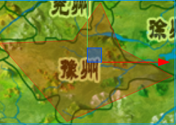
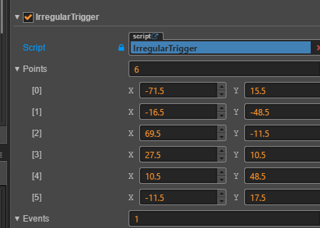
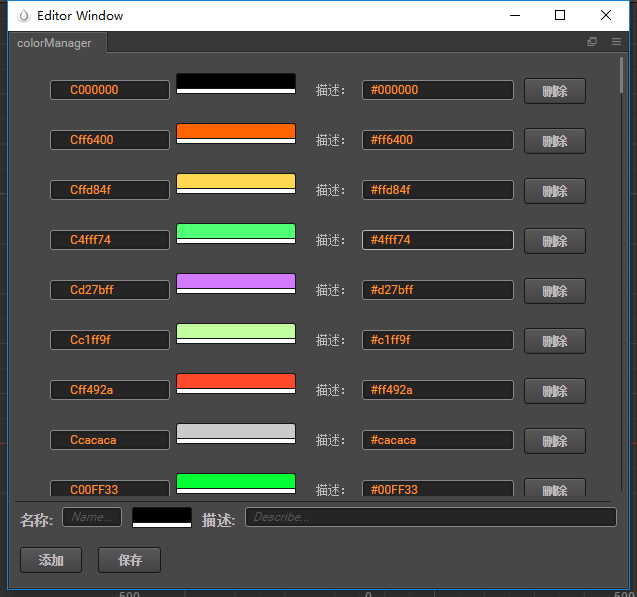
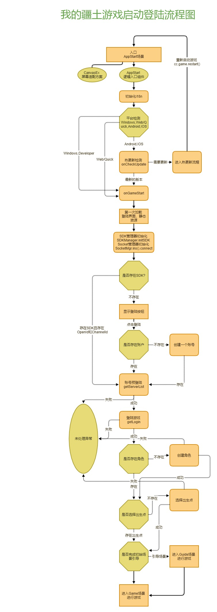

[TOC]

# Client

## 项目环境
### 客户端框架： 
CocosCreator (2.1.2)
### 语言： 
TypeScript,JavaScript,C++,glsl,python
### 开发环境： 
windows7/10;Mac
### 目录结构:
``` javascript
--| Client
    --| assets                  资源目录，也是主要的开发目录
        --| resources               资源目录
            --| Animation               动画
            --| Audio                   声音
            --| Data                    静态配置
            --| i18n                    多语言文本配置
            --| Prefabs                 预制件
            --| Texture                 纹理
            ...
        --| Scene                   场景
        --| Script                  代码
            --| Core                框架层代码
            --| Game                游戏层代码
            --| i18n                多语言支持代码(来源于cocos扩展商店，代码经过修改)
            --| Lib                 第三方代码
            --| Shaders             glsl
            ...
    --| build                   默认编译目录
    --| build-templates         编译模板目录
    --| coustom build dir       自定义编译目录
    --| packages                扩展插件目录
        --| ani-genator             flash动画配置扩展
        --| builder                 构建后期事件处理扩展
        --| hot-update-tools        热更新插件（来源于cocos扩展商店，代码经过修改)
        --| irregular-touch-editor  不规则触摸控件gizmo扩展
        ...
    --| setting                 设置
    --| project.json            项目配置文件
    --| tempalte.json           模板配置文件
    --| readme.md
    --| tsconfig.json
    --| jsconfig.json
```
# 部分代码
## Core
### 1. FrameEx
· 这部分为hook或者集成cocos engine基础类已经基础控件，其中包括cc.Node, cc.Canvas, cc.SliderEx, cc.Button;
· 新增了一下，ES5中不支持ES6特性的部分内容补充，比如Map,Set;
· 部分特性控件，flashFanimation（flash动画支持）, GLongTouch（长按控件）；
· Component为直接挂载组件，CCEx为hook原有函数，或者新增函数，非Component再Manager中存在调用工厂。
### 2. GEvent
#### a. 核心事件系统框架。使用范例如下:
##### i. 注册
``` TypeScript
    class TestTarget {
        constructor() {
            GEventSystem.on('msgId', this, this.onEvent.bind(this));
        }

        public onEvent(_, param: GParam) {
            cc.log(param.get<string>());
        }
    }
    
```
##### ii. 注销
``` TypeScript
    GEventSystem.off(this);
```
##### iii. 推送
``` TypeScript
    GEventSystem.emit('msgId', new GParam('this is a msg'));
```
#### 事件参数：
事件参数分未2类，一类是网络回包： TcgRespone;一类是自定义参数类型GParam,这里提供GParam使用范例:
``` TypeScript
    // 如果只有一个参数：
    let param = new GParam('具体参数内容');
    // 获取具体三处
    cc.log(param.get<string>());

    // 如果存在多个参数:
    let params = new GParam();
    params.set('id', 102547);
    params.set('name', 'nickName');
    // 获取具体参数
    cc.log(params.get<string>('nickName') + params.get<number>('id'));
```

### 3.资源加载模块
    资源加载模块主要内容再GLoader中，主要是对cocos creator engine 中cc.loader模块进行二次封装，已经实现游戏层面上可控的资源预加载，如有需要会拓展资源监视部分内容。
``` typescript
    // 精灵资源加载
    GLoader.spriteFrame(this.sprite, 'Texture/views/common/common_1', false, (sprite)=>{
        cc.log('加载完成');
    });
    // 图集资源加载
    GLoader.spriteAtlasFrame(this.sprite, 'Texture/voews/common/common_atlas', 'dianomd', false, (sprite)=>{
        cc.log('加载完成');
    });
    // json文件加载
    GLoader.json('Data/mapdata.json', (asset)=>{
        cc.log(asset.json);
    });
    //预制件加载
    GLoader.prefab('Prefabs/Views/LogionCtrl/LoginCtrl', (prefab)=>{
        let node = cc.instantiate(prefab);
        if(!node) return null;
        node.parent = this.node;
    });
```

### 4. 网络模块
#### a. Http: 
GHttpClient, eg:
``` typescript
    GHttpClient.get('get_version', {token:'xxxxxx', id: 'asdifasd'}, (ret)=>{
        cc.log(ret);
    }, 'http://192.168.2.101');
```
#### b. Socket：
为了兼容原生端和web端的socket连接，所以采用WebSocket进行socket通信；基于公司开发环境采用网易开源游戏框架[pomelo](https://github.com/NetEase/pomelo)。客户端通过第三方库 'Scrpit/Lib/LibPomelo.js'进行pomelo通信, 需要注意的是 pomelo 客户端为单例对象。
``` typescript
    let socket = pomelo.init({
        host: "ws://192.168.2.11",
        port: "9001",
        reconnect: true,
    });

    // req ==> res, 客户端请求，服务端回复
    pomelo.request("game.maphandler.login", {"token": "asdhfuaisnbni", userid: "20125475"} (respone)=>{
        cc.log(respone);
    });

    // notify 客户端通知服务端
    pomelo.notify("game.maphandler.notify", {something: "notify data"});

    // on 服务端通知客户端
    pomelo.on('game.maphandler', (msg)=>{
        cc.log(msg);
    })
```

### 4.视图组件以及控件
#### a.GViewBase
视图组件基类，示例：
```typescript
class test extends GViewBase {

}
```

#### b.GChild
需要通过this.gchild实例化预制件需要继承GChild，一般用于需要添加子节点的地方，示例：
```typescript
class testClass extends GChild{

}

class testClass2{
    this.gchild('prefab path',(cell:testClass)=>{
        this.cnt.addChild(cell.node)
    })
}
```

#### c.GListView
对cc.ScrollView组件进行封装,其content下的子节点只能为相同的预制件实例化,示例：
```typescript
    //先获得ScrollView组件的三个节点
    @property(cc.ScrollView) scrollView: cc.ScrollView = null;
    @property(cc.Node) view: cc.Node = null;
    @property(cc.Node) content: cc.Node = null;
    onGStart(){
        GCtrl.prefab('prefab path', prefab => {
            this._listView = new GListView({
                    scrollview: this.scrollView,
                    mask: this.view,
                    content: this.content,
                    itemTpl: cc.instantiate(prefab),
                    itemSetter: this.onItemSetter,
                    ...
                })
            })
        }

    onItemSetter(){
        ...
    }
        
```
#### d.GPageView/GPage
继承于GChild,因此可以通过this.gchild来实例化,可调用方法进行页面的显示与关闭
```typescript
////////////////////////////////GPage///////////////////////////////
// 视图被切换的时候调用
onPageOut() {}

// 视图被激活的时候调用
onPageIn() {}

////////////////////////////////GPageView///////////////////////////////
// onGstart的时候传入分页
onGStart(nPage) {}

// 分页被选中的时候的回调，不需要处理切页，只需要处理切页以外的内容
onSelected() {}

// 同上，分页被取消的时候的回调
onUnSelected() {}

// 检测是否可以切页
isCanSwitch(nPage: number, isCanToast: boolean = true) {}

// 切页函数，可以自己重载
onSwitch(nOldPage: number, nNewPage: number)

// 切出动画
outAction() : cc.Tween;

// 切入动画
inAction() : cc.Tween;

```


#### e.GScrollView
对cc.ScrollView的另一种封装，可通过key值传入不同的子节点，示例：
```typescript
@property(cc.Node) cardCnt: cc.Node = null;
onGload(){
    UICreate.createSplitNode(L('hero_in_army'), (spliteNode: cc.Node) => {
        this._gScrollView = new GScrollView({
            scrollview: this.cardCnt.parent.parent.getComponent(cc.ScrollView),
            mask: this.cardCnt.parent,
            content: this.cardCnt,
            item_templates: [
                { key: 'bar', node: spliteNode },
                { key: 'card', node: cellNode }
            ],
            item_setter: this.itemSetter.bind(this),
        })
})}
```
####f.IrregularTrigger
添加该组件后，可以在场景编辑器中通过点击来添加节点，多个节点可以形成一个新的点击区域

并且在属性检查器中可以编辑区域节点


### 5.管理器
#### a. AudioMgr， 音频管理器
``` Typescript
    // 获取管理器
    let audioMgr = AudioMgr.Ins();
    // 背景音乐
    audioMgr.playMusic('back.mp3');
    // 音效
    audioMgr.playEffect('effect.mp3', (path, effectId)=>{});
    // ...
```
#### b. DataPool, 数据池
客户端数据池，数据池分为2部分，一部分为静态数据池，一部分为动态数据池。静态数据池一般用于静态配置表的数据，动态数据池一般用于和服务端交互的动态数据缓存。
``` Typescript
    // 获取数据池
    let dataPools = DataPool.Ins();
```
##### i. 静态数据池
要使用静态数据池，需要先创建数据对象，然后加载对应的静态配置，实例化对象。
``` TypeScript
    export class SCardLevelRaw extends GDataRaw {
        public readonly cardLv : number;
        public readonly cardExp : number;
    }

    const {ccclass} = cc._decorator;
    @ccclass
    export class SCardLevel extends GStatic {
        public parse(obj:any) : boolean {
            for(let i = 0 ; i < obj.data.length; i++) {
                let raw = new SCardLevelRaw;
                raw.parse(obj.data[i]);
                this.data.set(raw.cardLv, raw);
            }
            return true;
        }
    }

    // 加载数据, 数据只需要再初始化的时候加载, 或者使用dataPools.loaders进行批量加载
    dataPools.loader('Data/cardLevel', 'SCardLevel');
```
只有确认数据加载完成后才可以正常使用数据对象
``` typeScript
    // 当确认数据加载完成时
    let pool = dataPools.getStatic(SCardLevelData);
    let raw = pool.getRaw<SCardLevelDataRaw>(1003);
    cc.log(raw);
```
##### ii. 动态数据池
动态数据池的拓展性比较随意，限制也比较少，主要时为了方便对服务端发送的数据进行缓存已经相关处理，使用起来和静态数据池的用法差不多。首先需要实现一个数据类，然后数据类将管理某一部分的服务端数据，数据池主要时提供获取和操作的接口。
``` typescript
    export class UserData extends GRunTime {
        _user: IUserData;
        public get IuserData() {return _userData; }

        // 必须重载的虚函数， 用来注册相关开始事件，服务端消息监听， 还有一些自定义的客户端数据初始化处理。
        onInit() { 
            //TODO: ...
         }
    }
```
动态数据池再使用上少了一步加载，但是要保证再对应的服务端数据下发前，需要实例化好数据池，以用来接收需要缓存的服务端数据, 使用方法如下：
``` typescript
    let iUserData = (dataPools.getRunTime(UserData).IUserData);
```
#### c. 动画管理器
动画管理器目前相对简陋，但是暂时满足游戏相关需求。
由于本游戏采用的时flash动画，配套公司的flash动画带出脚本，以及flash动画插件生成的配置来实现flash动画加载
``` typescript
    // flash动画加载
    GAnimationMgr.Ins().getFlashNode('Animation/effect_1', (node, ani, clip)=>{
        node.parent = this.node;
        ani.play(clip.name);
        ani.on('stop', ()=>{
            cc.log('this. animation is stop');
        })
    });

    // 获取falsh动画Clip
    GAnimationMgr.Ins().getFlashClip('animation/effect_1', clip=>{
        let node = new cc.Node();
        node.addComponent(cc.Sprite);
        let animation = node.addComponent(cc.Animation);
        animation.addClip(clip);
        node.parent = this.node;
        animation.play(clip.name);
    });
```
这边要提一下Ex模块中的俩个组件：GAnimation和FlashAnimation这俩个都是动画组件，前者只包含SpriteFrame信息，后者效果同getFlashNode。

##### d. 节点池
本游戏的设计采用大量的节点池。几点吃是一个虚类，需要继承实现实体类。
主要表现在创建，展示，回收三部分内容。

##### e. 时间管理器
这是一个全局的时间定时器。

##### f. socket管理器
SocketMgr是基于公司实况对pomelo网络的二次封装，将不会通过pomelo自带的req==>res模式进行消息通信，而是通过GEventSystem来统一调用游戏网络事件
``` typescript
    // 连接
    SocketMgr.Ins().connect('ws://192.168.2.165', 7548);
    // 发消息，msg 是继承Msg类的对象，其中至少要包含__route__和token字段
    SocketMgr.Send(msg); 
    // 收消息， 如果服务端推送，或者返回__route__的相关消息，则会将这条route作为事件ID进行消息派发，各个模块分别进行监听。
    GEventSystem.Ins().on(__route__, this, this.onRPCEvent.bind(this), PRIORITY_VIEW);
```

#### g.UI管理器(UIMgr)

初始化UI配置：
``` js
    // 初始化窗口id列表，初始化窗口模态信息， 初始化预加载资源列表，全局toast注册。
    initWinInfos(infos: WinInfos, preLoadAsset: { [id: number]: PreLoadAsset[] }, creatorToastCb)
```
初始化完成之后，可以调用showWin方法，根据配置，进行窗口的展示，切换等。
``` js
    UIMgr.showWin(winId);
```
UIMgr在逻辑层启动之后，会内嵌到GamMgr.uiMgr中；

#### h.色彩管理器插件（逻辑层）

> colorManager 是一个色彩管理工具。 
>
> 实现对项目颜色的增加、修改、删除功能，并导出 `JXColor` 全局对象。




```js
//使用
let color:cc.Color = JXColor.C00FF33;//返回 cc.Color类型
```


### 模块按需进行分包加载
 引入了Bundle，对模块进行分包,首次先加载必须的分包，剩余分包按需进行加载。
```js
  /**加载分包 */
    protected loadPackage(bundles, cb) {
        this.setLoadText(L(JXLocales.load.loadPackage));
        let keys = Object.keys(bundles);
        if (keys.length == 0) {
            cb();
            return;
        }
        const str = bundles[keys[this.loadNum]];
        cc.assetManager.loadBundle(str, (err: Error, boule: cc.AssetManager.Bundle) => {
            if (err) {
                cc.error("分包加载失败:" + str);
            } else {
                cc.log("分包加载成功:" + str)
            }
            this.loadNum++;
            this.setLoadProgress(this.loadNum / keys.length);
            if (this.loadNum < keys.length) {
                this.loadPackage(bundles, cb);
            } else {
                this.loadNum = 0;
                cb()
            }
        });
    }

```
先判断资源是否加载
```js
    public loadRes() {
        let resArgs: LoadResArgs = this._makeLoadResArgs.apply(this, arguments);
        // 预判是否资源已加载
        let res = this.getRes(resArgs);
        if (res) return;
        this.getBundle(resArgs.bundle, (bundle: cc.AssetManager.Bundle) => {
            this.__nLoadRef++;
            bundle.load(resArgs.url, resArgs.type, resArgs.onProgess, (err, res) => {
                if (!err) {
                    this._assetTypes[resArgs.url] = resArgs.type;
                }
                this.__nLoadRef--;
                this.finishCallback(resArgs, err, res);
            });
        })
    }
```

### 8. Math
数学库
### 9. 平台，渠道
#### 主要基类是SDKBase（SDK基类）, SDKManager（SDK管理器）, SysManager(平台管理器)
SDK主要接口在SDKBase里面。
然后各个平台做继承处理。

渠道调度，平台调度，充值调度。
#### i.SDKBase
sdk基类
#### ii. SysPlatformManager
平台管理器，主要实现一些平台特殊的方法，这里的平台是指IOS,Android,Web,WechatGame...
#### iii. SDKManager
SDK管理器，用来管理游戏中使用的SDK。
### 10. 热更新
原生平台热更新。

***************
* 以上内容为的内容，有部分内容可能过时，并未更新
****************

## Game
### 游戏启动流程
流程图如下（PS：没空画新的，大体流程时一致的）：


## 构建
### 1.构建插件结构
```javascript
--| builder                             插件根目录
    --| node_modules                        插件库目录
    --| pngquant                            png压缩工具（windows平台）
        --| pngquant.exe
        --| JPGC.exe
    --| sdkTemplate                         fix代码模板（各个平台需要额外添加或者修改的代码）
        --| web-desktop                     页游 //由于这一项目前由服务端提供，所以客户端的构建是不生效的
        --| web-mobile                      移动端//由于这一项目前由服务端提供，所以客户端的构建是不生效的
        --| wgame                           微信小游戏
            --wgame-adpter.js               构建后需要对game.js的修改以及添加，基本上所有启动层的代码都在这边执行。
            --wx-downloader.js              适配自己的资源加载方案。
    --| gulpfile.js                         gulp构建（暂时没有使用）
    --| main.js                             插件入口代码，主要流程控制
    --| build.js                            构建逻辑具体内容处理
    --| file-utils.js                       文件帮助接口
    --| merge-json.js                       json的一些操作接口
    --| wdconfig.js                         构建配置文件，由于cocoscreator没有构建透参，所以目前通过title指定构建配置，该title对应wdconfig的key.
    --| main.txt                            游戏main.js模板代码
    --| package-lock.json                   ..
    --| package.json                        ..
    --| pngquant.py                         png/jpg批量压缩脚本
```
### 2.构建流程：
项目自定义了部分构建流程，在项目构建完成之后调用构建插件builder进行部分自定义构建。
构建的流程可以在builder/main.js中直观的看到,主要分为3个步骤：
```
· 开始构建之前 获取构建参数 ====> onStartBuild
· 基本构建完成 没有加MD5，还有部分其他的文件的时候 ====> onBeforeBuildFinish
· 构建完成 这个完成时指cocos的流程结束了 ====> onBuildFinished
```
具体的构建内容有很多细节，可以就直接看内容了，我尽量写清楚注释。

### 3.出包流程
出包流程规范如下：
· 非本地测试，一律使用bat脚本出包，最大限度避免手误：
· 原则上构建完成后不能修改任何代码。
· 构建之前需要同步最新的代码以及资源。

#### 附一
命令行编译脚本
``` bat
    ::chcp 65001
    echo 更新工程
    git fetch
    git pull

    rem 构建平台参数
    set platform=%1
    if "%1" equ "" (set platform=web-mobile)
    echo 选择的构建平台为 %platform%

    rem 构建模式参数
    set buildTitle=%2
    if "%2" equ "" (set buildTitle=default)
    echo 选择的构建模式为 %buildTitle%

    rem 调试模式参数
    set isDebug=%3
    if "%3" equ "" (set isDebug=false)
    echo 选择的调试模式为 %isDebug%

    echo 开始构建

    set "EXEPATH=D:\CocosCreator_2.1.2"
    set "PROJECTPATH=E:\FengJi\xiuxian\xiuxian_client"

    cd %PROJECTPATH%
    "%EXEPATH%\CocosCreator.exe" --path %PROJECTPATH% --build "platform=%platform%;debug=%isDebug%;md5Cache=true;title=%buildTitle%"
```

#### 附二
资源构建脚本
``` bat
    ::chcp 65001
    rem 项目SVN根目录
    set "SVN_ROOT=E:\FengJi\xiuxian\XiuXian\"
    :: 项目策划数据表目录
    set "CEHUA_JSON_ROOT=%SVN_ROOT%策划\数据表-xlsx2json"
    :: 项目程序共享目录
    set "CHENXU_GONGXIANG=%SVN_ROOT%程序共享目录"
    :: 项目客户端目录
    set "CLIENT_ROOT=E:\FengJi\xiuxian\xiuxian_client\"、
    :: 项目图集工程目录
    set "TXPACKER_PROJ=%SVN_ROOT%TXPackerProj\"
    :: 图集打包工具目录
    set "TEXTURE_PACK_PATH=D:\Program Files\TexturePacker\bin"


    :: 同步错误码
    cd %CHENXU_GONGXIANG%
    del %CHENXU_GONGXIANG%\code-tool\codeError.json
    TortoiseProc.exe /command:update /path:"./" /closeonend:1
    rem 生成错误码json
    cd %CHENXU_GONGXIANG%/code-tool
    node ./codeTool.ts
    rem 拷贝协议到项目
    cd %CHENXU_GONGXIANG%

    REM for /r "%CLIENT_ROOT%assets\Script\conventions" %%i in (*.ts) do (
    REM    echo %%i
    REM    del "%%i"
    REM )
    REM for /r "%CLIENT_ROOT%assets\Script\conventions" %%i in (*.md) do (
    REM    echo %%i
    REM    del "%%i"
    REM )
    REM xcopy /E  %CHENXU_GONGXIANG%\conventions\* %CLIENT_ROOT%assets\Script\conventions

    :: 同步策划表格
    cd %CEHUA_JSON_ROOT%

    rem 删除本地表格
    del /S /Q %CEHUA_JSON_ROOT%\json\client\*.*
    del /S /Q %CEHUA_JSON_ROOT%\json\server\*.*
    del /S /Q %CEHUA_JSON_ROOT%\code\client\*.*
    del /S /Q %CEHUA_JSON_ROOT%\code\server\*.*

    TortoiseProc.exe /command:update /path:"./" /closeonend:1

    :: 生成表格
    cd %CEHUA_JSON_ROOT%
    echo 生成静态表
    node index.js --export
    echo convert json over!
    node index.js --generate
    node index.js --appedCodei18n ../../程序共享目录/code-tool/codeError.json "./json/client/mulLangugeData.json"

    echo 静态表生成完成，拷贝静态表
    :: 拷贝表格
    xcopy /S /E /Y %CEHUA_JSON_ROOT%\code\client\* %CLIENT_ROOT%d.ts\declare-table-raw
    xcopy /S /E /Y %CEHUA_JSON_ROOT%\json\client\* %CLIENT_ROOT%assets\resources\data


    :: 生成图片
    echo 图片资源处理， 资源同步不会关闭svn更新界面，因为有可能需要处理冲突
    cd %TXPACKER_PROJ%

    rem 清空output目录()
    :: /closeonend:1
    TortoiseProc.exe /command:update /path:"./" 

    for /r "%TXPACKER_PROJ%project" %%i in (*.tps) do (
        echo %%i
        "%TEXTURE_PACK_PATH%\TexturePacker.exe" %%i
    )

    echo 拷贝图集
    set "OUTPUT_PATH=%TXPACKER_PROJ%output"
    set "COMMON_PATH=%CLIENT_ROOT%assets\resources\texture\views"
    set "ANIS_PATH=%CLIENT_ROOT%assets\resources\anis\frames"
    set "I18N_PATH=%CLIENT_ROOT%assets\resources\i18n\zh\texture\views"

    xcopy /Y %OUTPUT_PATH%\* %COMMON_PATH%
    xcopy  /S /E /Y %OUTPUT_PATH%\anis\* %ANIS_PATH%
    xcopy  /S /E /Y %OUTPUT_PATH%\i18n\* %I18N_PATH%

    echo 拷贝散图
    set "UNPACK_PATH=%TXPACKER_PROJ%\unpack"
    set "UNPACK_CLIENT_PATH=%CLIENT_ROOT%assets\resources\texture"
    xcopy  /S /E /Y %UNPACK_PATH%\* %UNPACK_CLIENT_PATH%

    echo 资源配置构建完成
    pause
```

#### 附三
关于UI框架修改的目的和初衷，以及注意事项[前往查看](./README-UI-CHANGE.md).

### 附四
关于资源加载的修改以及一些重要接口的变更[前往查看](./README-GLOADER-CHANGE.md).
### 附五
启动参数详解[前往查看](./README-APP-CONFIGURE.md)
### 附六
客户端规范 [ver.0.0.1](./README-DEVELOPER-STANDARD.md)


